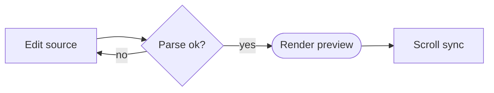
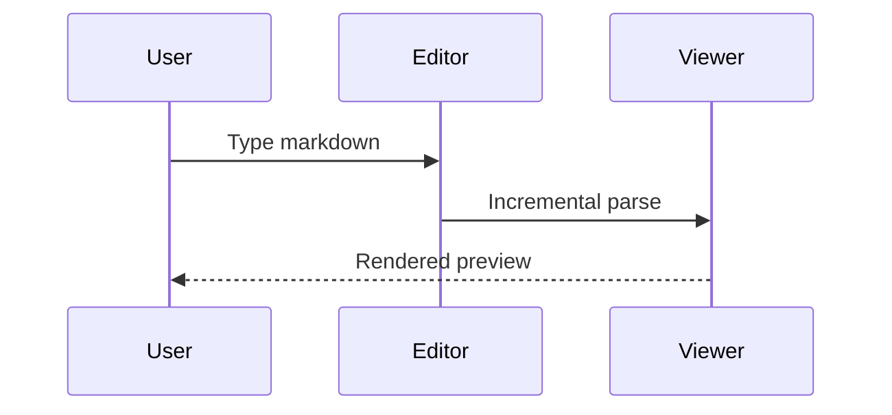
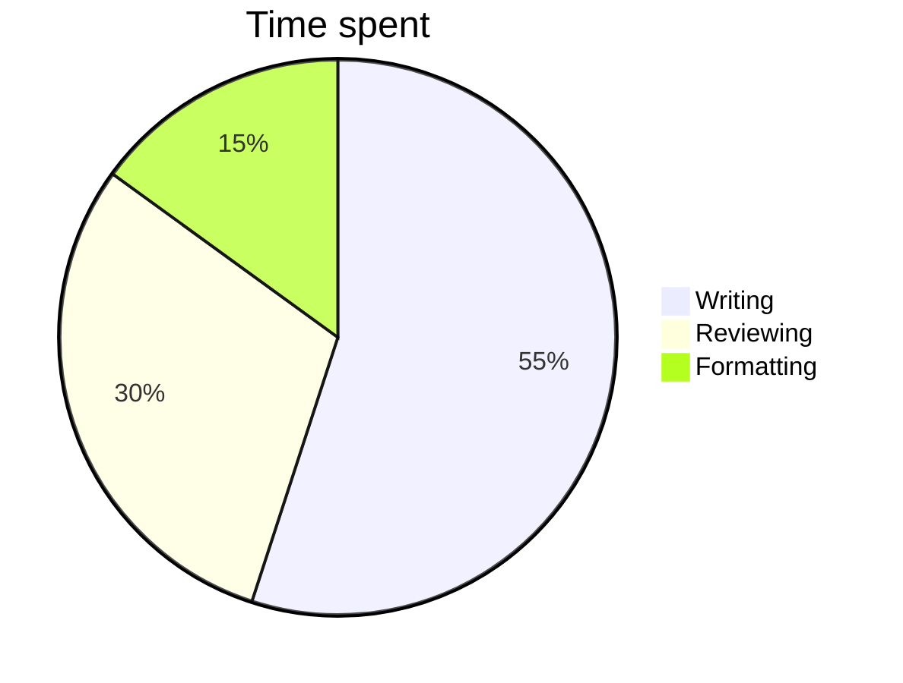

# Markdown4D Feature Showcase

This document exercises everything the Markdown4D viewer can render natively on the
canvas: text formatting, lists, tables, code, charts and diagrams. Open it in either
the VCL or the FMX Markdown4DStudio and scroll along with the contents panel on the left.

## Text formatting

Plain paragraphs wrap to the width of the preview pane. Inline styles include
**bold**, *italic*, ***bold italic***, ~~strikethrough~~ and `inline code`.
You can combine them, such as **bold with `code`** or *italic with a
[link](https://github.com/GDKsoftware/Markdown4D)*.

Autolinks are detected too: https://github.com/GDKsoftware/Markdown4D

Use two trailing spaces for a hard line break:
first line here  
second line right below.

## Headings

# Heading level 1
## Heading level 2
### Heading level 3
#### Heading level 4
##### Heading level 5
###### Heading level 6

## Lists

Unordered list with nesting:

- Editor and preview stay scroll-synced
- Formatting toolbar and shortcuts
  - **Ctrl+B** bold, *Ctrl+I* italic
  - Ctrl+K link, code block button
    - Deeply nested items keep their indentation
- Drag tabs to reorder, middle-click to close

Ordered list:

1. Type Markdown on the left
2. Watch the incremental preview on the right
3. Export to HTML or copy the fragment

Task list:

- [x] Live preview on the VCL canvas
- [x] Native charts and diagrams
- [ ] Your next document

## Blockquotes

> A blockquote can hold multiple paragraphs.
>
> > And it can nest another quote inside it,
> > spanning several lines.

## Table

Tables support per-column alignment:

| Feature        | Status | Notes                       |
|:---------------|:------:|----------------------------:|
| Headings       |  Done  |            Levels 1 up to 6 |
| Tables         |  Done  |     Left, center and right  |
| Charts         |  Done  |     Bar, line, pie, doughnut|
| Diagrams       |  Done  |  Flowchart, sequence, pie   |

## Horizontal rule

Above the line.

---

Below the line.

## Code

Fenced code blocks keep their language for syntax highlighting:

```pascal
procedure Greet(const Name: string);
begin
  Writeln(Format('Hello, %s!', [Name]));
end;
```

```json
{
  "product": "Markdown4D",
  "renders": ["text", "tables", "charts", "diagrams"],
  "embeddedBrowser": false
}
```

Inline code such as `TMarkdownViewer` stays monospaced within a sentence.

## Charts

Chart code blocks use the Codolex JSON format and render natively, no browser needed.

A bar chart:

```json
{"type":"chart","data":{"type":"bar","data":{"labels":["Edit","Preview","Sync","Export"],"datasets":[{"label":"Coverage","data":[100,100,90,80],"backgroundColor":"#4E79A7"}]},"options":{"plugins":{"title":{"display":true,"text":"Feature Coverage"}},"scales":{"y":{"min":0,"max":100}}}}}
```

A line chart:

```json
{"type":"chart","data":{"type":"line","data":{"labels":["Mon","Tue","Wed","Thu","Fri"],"datasets":[{"label":"Words written","data":[120,340,280,510,430],"borderColor":"#E15759","backgroundColor":"#E15759"}]},"options":{"plugins":{"title":{"display":true,"text":"Weekly Output"}}}}}
```

A pie chart:

```json
{"type":"chart","data":{"type":"pie","data":{"labels":["Editor","Preview","Contents"],"datasets":[{"data":[45,40,15],"backgroundColor":["#4E79A7","#F28E2B","#59A14F"]}]},"options":{"plugins":{"title":{"display":true,"text":"Screen Real Estate"}}}}}
```

A doughnut chart:

```json
{"type":"chart","data":{"type":"doughnut","data":{"labels":["Done","Remaining"],"datasets":[{"data":[60,40],"backgroundColor":["#4E79A7","#F28E2B"]}]},"options":{"plugins":{"title":{"display":true,"text":"Progress"}}}}}
```

## Diagrams

Mermaid fenced blocks upgrade to native graphics once the fence closes.

A flowchart:



A sequence diagram:



A pie diagram:



## Images

Inline images load through the viewer's image pipeline (needs network for remote URLs):


## Wrap up

> Open a `README.md` to edit it live, then **Save** to write it back. Everything above
> renders directly on the native canvas, with no embedded browser anywhere in sight.
