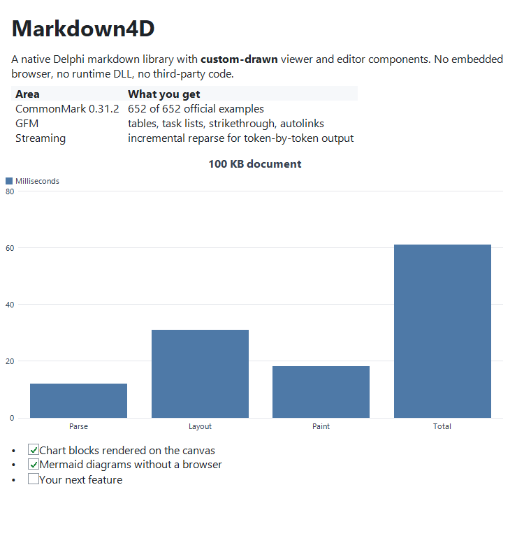
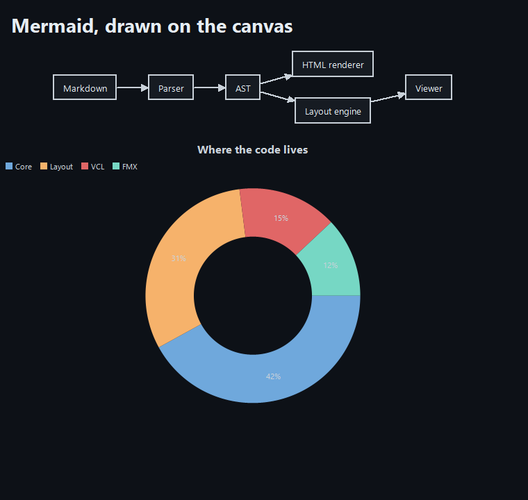

# Markdown4D

Markdown4D is a CommonMark / GFM markdown library written in Delphi. It parses
markdown into a typed AST, renders HTML, writes markdown back out, and ships
custom-drawn viewer and editor components for VCL and FMX. Everything is plain
Object Pascal on top of the RTL; rendering happens on a canvas, without an
embedded browser.

<!-- badges -->
[](LICENSE)
[](https://github.com/GDKsoftware/Markdown4D/releases)
[](https://www.embarcadero.com/products/delphi)
[](https://spec.commonmark.org/0.31.2/)

<p align="center">
  
</p>

<p align="center"><em>An answer arriving token by token: source on the left, live preview on the right.
The chart and the diagram are drawn on the canvas as their fences close. Nothing
here is a browser, and the animation itself is rendered by the library through
<code>tools\Make-Demo.ps1</code> rather than captured off a screen.</em></p>

<p align="center">
  
  
</p>

<p align="center"><em>Both screenshots show the VCL viewer.</em></p>

## Why Markdown4D

The parser passes all 652 official CommonMark 0.31.2 examples and the GitHub
Flavored Markdown extension corpora (tables, task list items, strikethrough,
extended autolinks, disallowed raw HTML).

Parsing produces a typed, documented `IMarkdownDocument`. The tree can be
inspected or transformed and written back to markdown with the round-trip
writer.

An incremental parser reparses only the region that changed, which keeps
editors responsive and handles token-by-token LLM output well.

The pipeline builder accepts custom inline and block syntax, delimiter
processors, renderer hooks and document processors. The bundled chart and
mermaid extensions are built on this same API.

`TMarkdownViewer` and `TMarkdownEditor` exist for both VCL and FMX. They are
custom-drawn and support theming, images, selection, search, syntax-highlighted
code, charts, mermaid diagrams and a design-time preview.

The whole library is written for this project and uses only the RTL. There is
no DLL to deploy and no package manager involved; adding the source folders to
the search path is enough. It supports Delphi 12 Athens and Delphi 13 and is
MIT licensed.

## Features

| Area | Description |
|------|-------------|
| CommonMark 0.31.2 | Full block and inline grammar, 652/652 official examples |
| GFM extensions | Tables, task list items, strikethrough, extended autolinks, tag filter |
| Public AST | Typed node interfaces, visitor, source spans, extension data slots |
| Round-trip writer | `IMarkdownDocument` → clean markdown, lossless editing |
| Document builder | Fluent, validated API to construct documents in code |
| Incremental parser | Append / replace-range reparsing for streaming and editors |
| HTML renderer | Spec-conformant output, safe by default, optional XHTML and tag filter |
| Table of contents | Slugged anchors with de-duplication from any document |
| Extension API | Block/inline parsers, delimiter processors, renderer hooks, document processors |
| Chart extension | `chart` code blocks rendered natively as bar/line/pie/doughnut graphics |
| Mermaid extension | `mermaid` fences rendered natively as flowchart / sequence / pie diagrams, with code-block fallback |
| VCL & FMX viewer | Themed rendering, async images, selection, copy, find, links |
| VCL & FMX editor | Syntax-highlighted source editing with an attachable live preview |
| SVG images | Shapes, groups, transforms, gradients, patterns, clip paths, masks, filters, `use`, embedded images and text, drawn by our own engine |
| Design-time | Live sample render on the form designer; components on the **Markdown4D** palette |

## Quick start

Markdown to HTML:

```pascal
uses
  Markdown4D;

const Html = TMarkdown.ToHtml('# Hello *world*');
```

`ToHtml` renders safely: raw HTML is omitted and scripting destinations such as
`javascript:` are emptied. For byte-for-byte specification output on input you
trust, use `TMarkdown.ToUnsafeHtml`.

A configured pipeline (GFM, raw HTML allowed):

```pascal
uses
  Markdown4D.Pipeline,
  Markdown4D.Extensions.Interfaces;

const Html = TMarkdownPipeline.Create
  .UseGfm
  .UnsafeHtml
  .Build
  .ToHtml(Source);
```

A viewer on a VCL form:

```pascal
uses
  Markdown4D.Theme,
  Markdown4D.Vcl.Viewer;

const Viewer = TMarkdownViewer.Create(Self);
Viewer.Parent := Self;
Viewer.Align := alClient;
Viewer.ThemePreset := TMarkdownThemePreset.Dark;
Viewer.Text := '# Welcome'#10#10 + 'This is **Markdown4D**.';
```

Streaming LLM output. The viewer reparses incrementally, debounces relayout
and follows the tail:

```pascal
procedure TChatForm.OnTokenReceived(const Token: string);
begin
  FAnswerViewer.AppendMarkdown(Token);
end;
```

`AppendMarkdown` is safe to call from a worker thread; it marshals to the UI
thread for you. See [docs/STREAMING.md](docs/STREAMING.md).

## Installation

Markdown4D is distributed as source. Add the source folders to your project's
search path:

```
Source\Core     framework-neutral parser, AST, renderer, writer, extensions
Source\Layout   framework-neutral layout engine, theme, viewer/editor models,
                rasterizer, SVG engine
Source\Vcl      VCL painter, viewer, editor
Source\Fmx      FMX painter, viewer, editor
```

A project that renders to HTML instead of to a control needs only
`Source\Core`.

For a component-palette install, build the runtime and design-time packages in
`packages\` and install the two design packages in the IDE. `{$LIBSUFFIX AUTO}`
targets Delphi 12 (`290`) and Delphi 13 (`370`) from the same sources. Full
build order and step-by-step IDE instructions are in
[packages/INSTALL.md](packages/INSTALL.md).

## Examples

The `Examples\` folder contains four runnable projects:

| Project | Framework | Shows |
|---------|-----------|-------|
| `Markdown4DStudioVCL` | VCL | Editor + live preview + table of contents, with native charts and mermaid diagrams |
| `StreamingMarkdownVCL` | VCL | Streaming chat with incremental render, async images, live charts and mermaid diagrams |
| `Markdown4DStudioFMX` | FMX | Editor + live preview, with native charts and mermaid diagrams |
| `StreamingMarkdownFMX` | FMX | Streaming chat with live charts and mermaid diagrams |

## Architecture

Markdown4D is strictly layered. `Core` and `Layout` are framework-neutral; only
the outermost layer knows about VCL or FMX.

```
             +--------------------+      +--------------------+
   VCL app   |  Source\Vcl        |      |  Source\Fmx        |  FMX app
             |  Painter / Viewer  |      |  Painter / Viewer  |
             |  Editor            |      |  Editor            |
             +---------+----------+      +----------+---------+
                       |                            |
                       +-------------+--------------+
                                     |
                       +-------------v--------------+
                       |  Source\Layout             |   framework-neutral
                       |  Layout engine, display     |
                       |  list, theme, hit-testing,  |
                       |  viewer/editor models,      |
                       |  block overrides            |
                       |  (charts, mermaid)          |
                       +-------------+--------------+
                                     |
                       +-------------v--------------+
                       |  Source\Core               |   framework-neutral
                       |  Parser (blocks + inlines), |
                       |  incremental parser, AST,   |
                       |  HTML renderer, markdown     |
                       |  writer, TOC, extensions,   |
                       |  pipeline builder           |
                       +----------------------------+
```

A single string of markdown flows through
`source → pipeline → AST → (HTML renderer | markdown writer | layout engine → display list → painter)`.

## Conformance dashboard

The suite runs the CommonMark and GFM specification corpora plus round-trip and
incremental parsing corpora on every build. The table below is regenerated by
`build.bat`.

<!-- conformance:start -->
| Corpus | Tests | Passed | Pass rate |
|--------|------:|-------:|----------:|
| CommonMark | 26 | 26 | 100.0% |
| Gfm | 5 | 5 | 100.0% |
| RoundTrip | 31 | 31 | 100.0% |
| Incremental | 62 | 62 | 100.0% |
| **Total** | **124** | **124** | **100.0%** |
<!-- conformance:end -->

Each corpus row aggregates its specification example groups; the full CommonMark
0.31.2 corpus covers all 652 official examples.

## Building & testing

Run the build script from the repository root:

```bat
build.bat
```

It compiles and runs the DUnitX main and FMX test suites, builds every example
and every package, and regenerates the conformance dashboard above.

## Documentation

- [docs/API.md](docs/API.md) covers the public surface: facade, pipeline, AST,
  builder, TOC, theme, and the viewer and editor components.
- [docs/EXTENSIONS.md](docs/EXTENSIONS.md) explains how to write extensions:
  the `==mark==` parser extension, an admonition custom-rendering walkthrough
  on the `IExtensionCanvas`, and the bundled chart and mermaid extensions.
- [docs/STREAMING.md](docs/STREAMING.md) is the LLM / streaming integration
  guide: `AppendMarkdown`, debounce, threading, charts and `Text` semantics.
- [packages/INSTALL.md](packages/INSTALL.md) describes the package build and
  the IDE install.

## Third-party code

None. Every line under `Source\` is written for this project, including the
anti-aliased polygon rasterizer and the SVG engine behind the viewers.

Two things an SVG needs from the machine it runs on, glyph outlines and image
decoding, are reached through seams. The system font engine and the VCL picture
classes answer them on Windows, and FMX answers them everywhere it runs, so
nothing has to be deployed beside the application on any platform.

The specification corpora under `Tests\specs` come from the CommonMark and GFM
specifications; see [Tests/specs/README.md](Tests/specs/README.md) for their
origin and licence.

## License

Markdown4D is released under the [MIT License](LICENSE).

Copyright (c) 2026 GDK Software

## Commercial Support

This library is MIT licensed and free to use. For companies that depend on it
commercially we offer support and maintenance agreements with guaranteed
response times, and sponsored development of features you need. Contact us at
[gdksoftware.com/contact-us](https://gdksoftware.com/contact-us) or open an
issue to get in touch.

## About GDK Software

Markdown4D is developed by [GDK Software](https://gdksoftware.com), a
Delphi-focused software company building developer tools, MCP integrations,
and enterprise applications.
