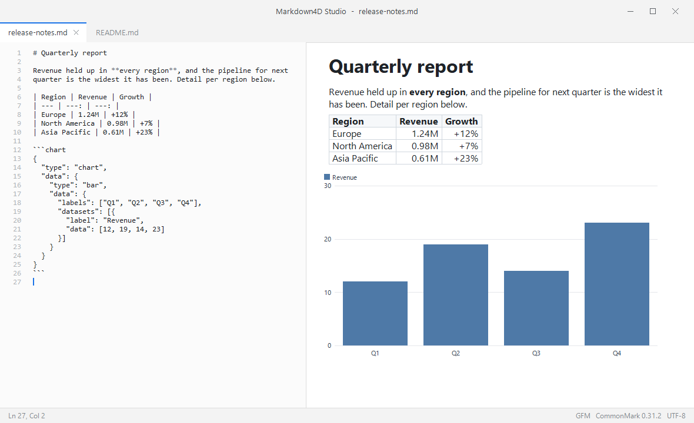
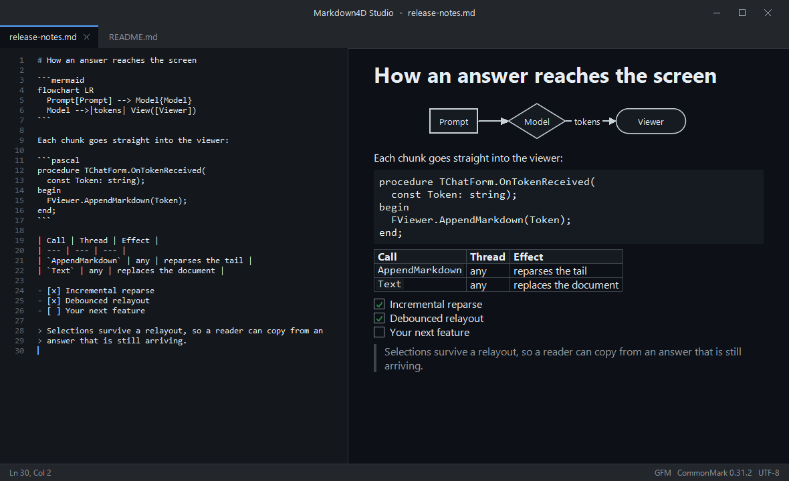
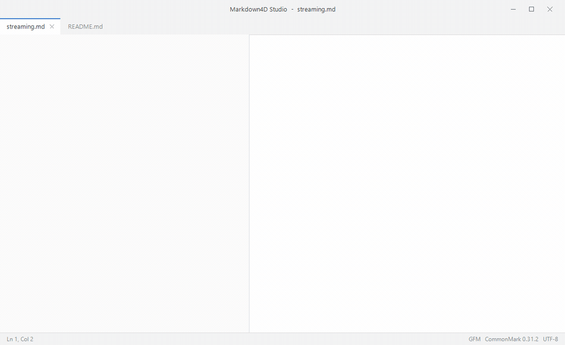

# Markdown4D

Markdown4D is a CommonMark / GFM markdown library written in Delphi. It parses
markdown into a typed AST, renders HTML, writes markdown back out, and ships
custom-drawn viewer and editor components for VCL and FMX. Everything is plain
Object Pascal on top of the RTL; rendering happens on a canvas, without an
embedded browser.

<!-- badges -->
[](LICENSE)
[](https://github.com/GDKsoftware/Markdown4D/releases)
[](https://www.embarcadero.com/products/delphi)
[](https://spec.commonmark.org/0.31.2/)

<p align="center">
  
  
</p>

*Markdown4D Studio, the editor example, in the light and the dark theme. Source
on the left, `TMarkdownEditor`; rendered document on the right,
`TMarkdownViewer`. The table, the bar chart, the flowchart and the highlighted
code are all drawn on the canvas from the markdown you see next to them.*

## Why Markdown4D

Markdown is a handy way to give plain text a visual shape, and Delphi had no
component that rendered it well, at runtime or on the form designer.

Markdown4D passes all 652 official CommonMark examples, and the library is
interface-based throughout: parsing hands you a typed `IMarkdownDocument`
rather than a string of HTML.

VCL and FMX are both supported, with no external dependencies. Charts and
mermaid diagrams are drawn natively, alongside the usual markdown constructs:
tables, task lists, links, raw HTML.

The pipeline builder accepts inline and block syntax of your own. The renderer
turns a document into HTML, the writer turns it back into markdown, so a round
trip through the tree gets you clean markdown out the other end. And it
streams, if that is what you need.

An incremental parser reparses only the region that changed. That is what
makes streaming practical: a log that grows, an import reporting as it runs, a
model answering a token at a time. It is also what keeps an editor responsive
on a large document.

Everything under `Source\` was written for this project and uses only the RTL:
no DLL of its own, no package manager involved. Delphi 12 Athens and Delphi
13, MIT licensed.

## Features

| Area | Description |
|------|-------------|
| CommonMark 0.31.2 | Full block and inline grammar, 652/652 official examples |
| GFM extensions | Tables, task list items, strikethrough, extended autolinks, tag filter |
| Public AST | Typed node interfaces, visitor, source spans, extension data slots |
| Round-trip writer | `IMarkdownDocument` → clean markdown, lossless editing |
| Document builder | Fluent, validated API to construct documents in code |
| Incremental parser | Append / replace-range reparsing for streaming and editors |
| HTML renderer | Spec-conformant output, safe by default, optional XHTML and tag filter |
| Raw HTML in the viewer | The allowed subset (images, links, emphasis, headings, lists, `<details>`, `<br>`, `<pre>`) is translated to markdown and rendered; `<script>` and `<style>` are dropped with their content |
| Table of contents | Slugged anchors with de-duplication from any document |
| Extension API | Block/inline parsers, delimiter processors, renderer hooks, document processors |
| Chart extension | `chart` code blocks rendered natively as bar/line/pie/doughnut graphics |
| Mermaid extension | `mermaid` fences rendered natively as flowchart / sequence / pie diagrams, with code-block fallback |
| VCL & FMX viewer | Themed rendering, async images, selection, copy, find, links |
| VCL & FMX editor | Syntax-highlighted source editing with an attachable live preview |
| SVG images | Shapes, groups, transforms, gradients, patterns, clip paths, masks, filters, `use`, embedded images and text, drawn by our own engine |
| Design-time | Live sample render on the form designer; components on the **Markdown4D** palette |

## Quick start

Markdown to HTML:

```pascal
uses
  Markdown4D;

const Html = TMarkdown.ToHtml('# Hello *world*');
```

`ToHtml` renders safely: raw HTML is omitted and scripting destinations such as
`javascript:` are emptied. For byte-for-byte specification output on input you
trust, use `TMarkdown.ToUnsafeHtml`.

A configured pipeline (GFM, raw HTML allowed):

```pascal
uses
  Markdown4D.Pipeline,
  Markdown4D.Extensions.Interfaces;

const Html = TMarkdownPipeline.Create
  .UseGfm
  .UnsafeHtml
  .Build
  .ToHtml(Source);
```

A viewer on a VCL form:

```pascal
uses
  Markdown4D.Theme,
  Markdown4D.Vcl.Viewer;

const Viewer = TMarkdownViewer.Create(Self);
Viewer.Parent := Self;
Viewer.Align := alClient;
Viewer.ThemePreset := TMarkdownThemePreset.Dark;
Viewer.Text := '# Welcome'#10#10 + 'This is **Markdown4D**.';
```

Text that arrives in pieces. The viewer reparses incrementally, debounces
relayout and follows the tail:

```pascal
procedure TReportForm.OnChunkReceived(const Chunk: string);
begin
  FViewer.AppendMarkdown(Chunk);
end;
```

A chunk may split a word, a `**bold**` span, a fenced block or a table row; the
incremental parser reconciles it when the next chunk completes it. That covers a
log that grows, an import that reports as it runs, a document assembled on the
fly, and a model that answers token by token.

`AppendMarkdown` is safe to call from a worker thread; it marshals to the UI
thread for you. See [docs/STREAMING.md](docs/STREAMING.md).

<p align="center">
  
</p>

*The same thing running: source on the left, live preview on the right, text
arriving a chunk at a time. The chart and the diagram appear as their fences
close. Nothing here is a browser, and the animation itself is rendered by the
library through `tools\Make-Demo.ps1` rather than captured off a screen.*

## Installation

Markdown4D ships as source, all of it, under the MIT licence. Add these folders
to your project:

```
Source\Core     framework-neutral parser, AST, renderer, writer, extensions
Source\Layout   framework-neutral layout engine, theme, viewer/editor models,
                rasterizer, SVG engine
Source\Vcl      VCL painter, viewer, editor
Source\Fmx      FMX painter, viewer, editor
```

If you only render to HTML, `Source\Core` is all you need.

For the design-time components, build the packages in `packages\` and install
the two design packages in the IDE. The full instructions are in
[packages/INSTALL.md](packages/INSTALL.md).

## Examples

The `Examples\` folder contains four runnable projects:

| Project | Framework | Shows |
|---------|-----------|-------|
| `Markdown4DStudioVCL` | VCL | Editor + live preview + table of contents, with native charts and mermaid diagrams |
| `StreamingMarkdownVCL` | VCL | Text streamed into a chat-style window: incremental render, async images, live charts and mermaid diagrams |
| `Markdown4DStudioFMX` | FMX | Editor + live preview, with native charts and mermaid diagrams |
| `StreamingMarkdownFMX` | FMX | The same streaming window on FireMonkey, with live charts and mermaid diagrams |

## Architecture

Markdown4D is strictly layered. `Core` and `Layout` are framework-neutral; only
the outermost layer knows about VCL or FMX.

```
             +----------------------+      +----------------------+
   VCL app   |  Source\Vcl          |      |  Source\Fmx          |  FMX app
             |  Painter / Viewer    |      |  Painter / Viewer    |
             |  Editor              |      |  Editor              |
             +----------+-----------+      +-----------+----------+
                        |                              |
                        +---------------+--------------+
                                        |
                  +---------------------v---------------------+
                  |  Source\Layout                            |  framework-neutral
                  |  Layout engine, display list, theme,      |
                  |  hit-testing, viewer and editor models,   |
                  |  block overrides (charts, mermaid)        |
                  +---------------------+---------------------+
                                        |
                  +---------------------v---------------------+
                  |  Source\Core                              |  framework-neutral
                  |  Parser (blocks and inlines), incremental |
                  |  parser, AST, HTML renderer, markdown     |
                  |  writer, TOC, extensions, pipeline        |
                  |  builder                                  |
                  +-------------------------------------------+
```

A single string of markdown flows through
`source → pipeline → AST → (HTML renderer | markdown writer | layout engine → display list → painter)`.

## Conformance dashboard

The suite runs the CommonMark and GFM specification corpora plus round-trip and
incremental parsing corpora on every build. The table below is regenerated by
`build.bat`.

<!-- conformance:start -->
| Corpus | Test cases | Passed | Pass rate |
|--------|-----------:|-------:|----------:|
| CommonMark | 26 | 26 | 100.0% |
| Gfm | 5 | 5 | 100.0% |
| RoundTrip | 31 | 31 | 100.0% |
| Incremental | 62 | 62 | 100.0% |
| **Total** | **124** | **124** | **100.0%** |
<!-- conformance:end -->

A test case runs a group of specification examples rather than a single one, so
the counts above are groups. The CommonMark corpus behind them covers all 652
official examples of version 0.31.2, and the GFM corpora cover the extension
examples.

## Building & testing

Run the build script from the repository root:

```bat
build.bat
```

It compiles and runs the DUnitX main and FMX test suites, builds every example
and every package, and regenerates the conformance dashboard above.

## Documentation

- [docs/API.md](docs/API.md) covers the public surface: facade, pipeline, AST,
  builder, TOC, theme, and the viewer and editor components.
- [docs/EXTENSIONS.md](docs/EXTENSIONS.md) explains how to write extensions:
  the `==mark==` parser extension, an admonition custom-rendering walkthrough
  on the `IExtensionCanvas`, and the bundled chart and mermaid extensions.
- [docs/STREAMING.md](docs/STREAMING.md) is the streaming integration guide:
  `AppendMarkdown`, debounce, threading, charts and `Text` semantics.
- [packages/INSTALL.md](packages/INSTALL.md) describes the package build and
  the IDE install.

## Third-party code

None. Every line under `Source\` is written for this project, including the
anti-aliased polygon rasterizer and the SVG engine behind the viewers.

Two things an SVG needs from the machine it runs on, glyph outlines and image
decoding, are reached through seams. The system font engine and the VCL picture
classes answer them on Windows, and FMX answers them everywhere it runs, so the
library itself adds nothing to what you deploy.

One footnote, because it is visible in the build output: the FMX examples set
`GlobalUseSkia := True`, which switches FireMonkey to its Skia canvas for
accurate text metrics in the editor and brings `sk4d.dll` along. That is a
choice of those examples, not a requirement of Markdown4D. The VCL examples ship
as a single executable.

The specification corpora under `Tests\specs` come from the CommonMark and GFM
specifications; see [Tests/specs/README.md](Tests/specs/README.md) for their
origin and licence.

## License

Markdown4D is released under the [MIT License](LICENSE).

Copyright (c) 2026 GDK Software

## Commercial Support

Markdown4D is MIT licensed, so it is free to use. For companies we offer a
support and maintenance contract, including sponsored development of the
features you need. Get in touch at
[gdksoftware.com/contact-us](https://gdksoftware.com/contact-us), or open an
issue.

## About GDK Software

Markdown4D is developed by [GDK Software](https://gdksoftware.com), a software
company building Delphi developer tools, MCP integrations, and enterprise
Delphi applications.
